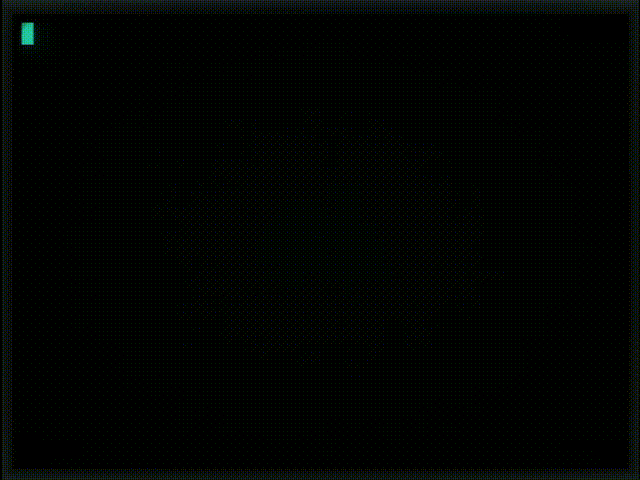

<h1 align="center">wake_up.cpp</h1>
<p align="center">
    <br>
    
    
    
    
    <br><br>
    
</p>

## About

A C++ program to replicate the famous prompt on Neo's screen from "The Matrix"

## Requirements

Packages: ```git``` ```make``` ```gcc```

## Installation

### Manual

#### Clone the repo
```shell
$ git clone https://github.com/rocketmike12/wake_up.cpp.git
```

#### Cd into the newly cloned folder
```shell
$ cd wake_up.cpp
```

#### Compile the binary
```shell
$ make
```
#### Copy the binary to /usr/local/bin/ to add it to PATH
```shell
$ sudo cp bin/wake_up /usr/local/bin/
```

## Usage

```shell
$ wake_up
```

## Compatibility

Please note that this program was developed and intended for Linux. It uses system commands, such as "clear" and "read". I do not own a MacOS environment or a BSD environment (and too lazy to set up one), but any help with porting will be greatly appreciated.

## Planned features
<ul>
    <li>"help" and "version" flags</li>
    <li>"loop" mode</li>
    <li>"screensaver" mode</li>
    <li>customizable delays and effects</li>
</ul>

## Misc
Demo animation made using [peek](https://github.com/phw/peek) and [cool-retro-term](https://github.com/Swordfish90/cool-retro-term/) <br>
Here is the [cool-retro-term theme](https://github.com/rocketmike12/crt_themes/blob/main/matrix.json) used in the demo animation
